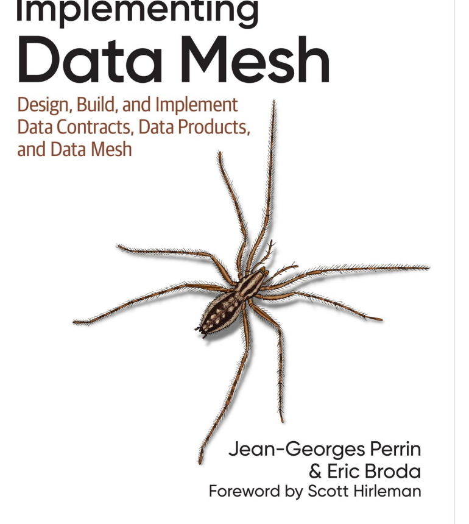

实施 Data Mesh

作者：Jean-Georges Perrin 和 Eric Broda

## 序言

当我在 2020 年底第一次接触到 Data Mesh 概念时，我对运维领域的最佳实践更加了解，尤其是站点可靠性工程 （SRE） 和分布式系统。 Data Mesh 概念的创建者 Zhamak Dehghani 提出了许多进行分析、机器学习和数据工作的方法，这些方法感觉非常熟悉，而且有点明显，因为它们在软件世界中已经采用了很长时间，例如所有权左移、产品思维、持续集成和持续交付 （CI/CD） 等。

然而，在我花了几周时间进行更深入的挖掘，包括人们在 LinkedIn 和 Twitter 上的帖子中对 Data Mesh 的实际评价之后，不仅仅是文章、演示文稿和播客，在所有事情背后都有一个响亮的问题：好的，但如何？ 数据世界总体上还没有做过任何接近 Data Mesh 所要求的工作，试图简单地跳入全新的方式，1）总体上具有破坏性，2）令大多数数据人深恶痛绝....。

由于围绕 Data Mesh 的所有问题，我创建了一个现在超过 10,000 人的社区 （Data Mesh Learning） 和一个播客，以 300 多集 （Data Mesh Radio） 来探索这一点。 因为这个问题仍然是当今 Data Mesh 最相关和最有害的问题：好吧，但如何解决？

从社区的早期开始，Jean-Georges 和 Eric 就一直在帮助人们探索这个问题。 我并不怀念每周都有 15 篇以此为标题的新文章的日子，但我们该如何在我们的组织中真正实施数据网格这一概念呢？

没有确切的答案，因为这就像问一个人如何过上好日子每个人对什么是重要的和什么是有价值的感觉是不同的，每个人的起点都是不同的。 如果你能合理地思考一下，我们如何做 data mesh 是不可能有准确答案的，因为每个组织都是不同的：组织的目标、成熟度、数据能为组织竞争带来什么帮助、组织结构等等。 如果您已经非常分散，但您的数据工作非常孤立，并且在业务线（又名域）之间共享不是现状，那么您必须采取的步骤与高度集中的命令和控制型组织的步骤大不相同。

但希望还是有的。 许多组织已经通过 Data Mesh 方法推动了巨大的价值。 自 Data Mesh 社区成立以来，Jean-Georges 和 Eric 一直在探索哪些模式对于您从今天的位置走向更好的状态真正重要。 当然，还有如何不断变得更好。 因为事情总是不能尽善尽美，但现在已经足够好了。 领导数据网格之旅的人可能需要做出成千上万个决定，但问题是，哪些决定在什么时候重要，为什么重要。

我要强调这一点，因为它实际上可能是第二重要的一点：在 Data Mesh 实施过程中，有_千_个决定要做。 从大局来看，大多数人都不太重要。 但这本书会帮助你专注于哪些决定能提供通往成功的最佳途径，以及哪些决定能提供通往成功的最大筹码。

就像你在院子里干活时选择穿什么衣服一样，这可能不会对你的生活产生什么影响（不过，一定要穿戴好安全装备！）。 但它可能会影响约会或面试的结果，在 Data Mesh 旅程中会有很多问题，您不确定正确的答案。 但这本书将帮助您更好地评估哪些真正重要，以及如何衡量您的方法的成功，以便您在继续追求更好的同时改进它。

使用 Data Mesh 取得成功的途径多种多样，我们已经在数百家公开谈论其发展历程的公司中看到了这一点。 因此，我们需要从这些组织那里了解什么是有效的以及为什么有效，并从中学习。 这就是 Jean-Georges 和 Eric 在这本书中为您所做的。 这是一项非常艰巨的任务，所以他们通过这本书让您的生活变得更加轻松！

在 1000 多次关于 Data Mesh 的对话中，我大概与近 500 人交谈过，但很少有人能像 Eric 和 Jean-Georges 一样，能够弄清什么时候什么事情重要，为什么重要，尤其是能够简明扼要地传达这些信息。 因为沟通是至关重要的，而且他们做得非常好。

同样重要的是，要注意 Data Mesh 文献中反复使用的一个词：旅程。 您不一定非要先做到这一点。 你会学习，最重要的是要意识到你可以尝试、测试和迭代。 这是关于变得更好，而不是变得完美。 千里之行，始于足下。 我们都仍在学习如何做好 Data Mesh，这本书浓缩了更广泛的社区和行业迄今为止所学到的大部分知识。 它可以极大地帮助您更好地使用Data Mesh，并通过专注于重要的事情而不是陷入成千上万个影响较小的决策中来减轻压力。

我还想再次强调，没有精确的玩法。 将您在这里读到的内容，理解决策背后的原因，并根据您的组织进行调整。 如果您想要一种简单的方法，只需将所有数据扔进数据沼泽中即可。 这需要您做一些工作，但我向您保证，Data Mesh 可以为组织带来难以置信的价值，并为领导实施的人员带来难以置信的个人价值和成就感。

最后，亲爱的读者，为了能让你看到精彩的内容，我想给你一个更简洁的警告和鼓励，那就是：你不能照搬别人的蓝图，但你绝对应该深入研究哪些决策是关键的杠杆点。 不要纠结于确切的技术细节 — Data Mesh 是使您的组织能够更好地利用数据的关键驱动力，但它的意义远不止于平台。 要有耐心，在做出不太好的决定时要给自己留有余地，并着眼于不断做出更好的决定。 祝你好运，这将是一段非常艰难的旅程。 :)

Scott Hirleman

Data Mesh Learning 创始人

主持人，_Data Mesh Radio_

## 前言

2019 年，Zhamak Dehghani 提出了 Data Mesh 的概念。 她花了 18 个月的时间将自己的想法提炼为 Data Mesh 的四项原则：域所有权、数据即产品、自助式数据平台和（我最喜欢的）联合计算治理。 运动开始了。 它拥有潮水般的力量--没有什么能阻挡它。 她的奠基之作《_Data Mesh_》（O'Reilly）于 2022 年出版，证实了整个行业向更好模式转变的力量和愿望。 但… 为了实现 Dehghani 的愿景，从业人员需要一本指南--一种构建 data mesh 的实用方法。 我们在 2023 年初承担了这项任务，现在正在向你们交付。 我们希望您会喜欢它。 如果这本书对您来说还不够，请记住，我们俩都可以帮助您实现 Data Mesh！

### 这本书适合谁？

本书适用于所有对数据网格概念和实施感兴趣的人，无论其专业知识水平如何。 我们非常重视您的关注，并很高兴与您分享我们的见解。 如果您是数据工程师，您将了解 Data Mesh 将如何发展您的工作和任务。 别担心——它会让你的日常生活变得更加有趣。 如果您是一名架构师，您将发现这种软件架构将如何使数据架构受益，并允许您构建更好的数据平台。

如果您是技术领导者，本书将为您提供构建和实施 Data Mesh 所需的所有帮助。 最重要的是，第 III 部分传授了大量有关变更管理和 Data Mesh 社交方面的知识。 如果您是非技术 C 级人员，这本书可能不是您的最佳投资，但它适用于您组织中的所有技术人员。 想想年终礼物、生日、周年纪念日… 你会让人们开心。

### 各部分和章节概述

本书分为 3 个部分，16 个节奏明快的章节。 第一部分，“基础”，建立了基础知识，并快速回顾了 Dehghani 的工作：

- 第 1 章，“了解 Data Mesh：要点”，概述了 Data Mesh 的基本原则，Data Mesh 是一种现代数据架构范式，可促进去中心化数据所有权，将数据视为产品，并为领域团队实施自助式基础设施。 本章以 Dehghani 的基础工作为基础，重点介绍了 Data Mesh 如何通过实现本地自治和更快的响应时间以及培养创新和协作文化，将敏捷性引入数据管理。

- 第 2 章，“应用 Data Mesh 原则”，总结了 Data Mesh 的关键原则，并重点介绍了这些原则如何应用于数据产品，包括 FAIR（可查找、可访问、可互操作和可重用）产品，以及优质数据产品的构成要素和数据产品的生命周期。 本章的目标是创建实用的 Data Mesh 路线图，将您的战略和愿景转化为可实现的计划，获得高管的支持和资金，赋予熟练的数据产品所有者决策权，并在保持灵活性并与业务目标保持一致的同时吸引客户。

- 第 3 章，“我们的案例研究：Climate Quantum Inc.”，介绍了 Climate Quantum Inc.，这是一家虚构的公司，利用 Data Mesh 功能来解决管理气候数据的复杂性，使其更易于访问、可用和值得信赖。 通过分散数据所有权和使用面向域的架构，Climate Quantum Inc. 旨在简化大量多样气候数据的发现、使用、共享和验证，从而为气候变化带来的多方面挑战提供可扩展的解决方案。

第二部分，“设计、构建和部署 Data Mesh”，重点介绍 Data Mesh 的技术方面：

- 第 4 章，“定义 Data Mesh 架构”，探讨了 Data Mesh 的核心组件，重点介绍了数据产品的架构以及更广泛的 Data Mesh 架构，并重点介绍了各种工件和开发、运行时和运营功能如何组合在一起以创建可发现、可观察和可操作的数据产品。 本章还深入探讨了如何通过 Data Mesh 主干服务、市场和注册表集成这些组件，并以 Climate Quantum Inc. 作为案例研究来说明这些原则在管理复杂气候数据方面的实际应用。

- 第 5 章，“使用数据合约驱动数据产品”，讨论了数据产品的实施，强调了数据合约在通过确保数据质量和服务水平来建立信任方面的作用，并使用 Climate Quantum Inc. 的示例来说明这些概念。 本章探讨了产品思维的原则，详细介绍了数据协定的要素，并介绍了数据服务质量 （Data QoS） 框架，该框架将数据质量维度与服务级别协议相结合，从而促进了标准化、可靠的数据管理方法。

- 第 6 章，“构建您的第一个数据产品”，将指导您完成创建初始数据产品的步骤，方法是了解其组件、利用数据协定、连接数据源和构建终端节点，同时确保集成可观察性、发现和控制服务。 本章强调了数据产品的标准化和模块化，通过使用 sidecar 和开放标准（如 Bitol 项目所倡导的标准）来简化开发和运营。

- 第 7 章，“与体验平面保持一致”，介绍了如何在数据网格中的三个功能区域之间分离职责：数据基础架构的基础架构体验平面、独立数据产品的数据产品体验平面以及用于互连数据产品和管理企业级工具的网格体验平面。 这些领域中的每一个都具有简化组织和减少认知负荷的特定功能。 本章还深入探讨了这些平面如何通信，特别关注用户和系统的反馈回路，这些反馈回路跨越平面传输以提高数据可靠性并为持续改进提供信息。

- 第 8 章，“网格化您的数据产品”，解释了如何在 Data Mesh 中注册、组合和利用多个数据产品，以提高其价值并确保数据质量和治理。 本章还重点介绍与生产者对齐和与使用者对齐的数据产品的关键概念。 最后，您将了解 Data Mesh 如何简化数据沿袭。

第三部分，“Data Mesh 的 GenAI、Teams、运营模式和路线图”，主要关注 Data Mesh 的运维和社交方面：

- 第 9 章，“运行和运维 Data Mesh”，探讨了如何使数据产品可被发现、可观察和安全，强调了 Data Mesh 中数据的动态性质、确保无缝操作所涉及的关键接口和流程，以及通过标准化和自助服务功能增强数据管理的机会，所有这些都最终促进了更敏捷、更高效的数据生态系统。

- 第 10 章，“创建 Data Mesh Marketplace”，通过提出 Data Mesh Marketplace 来解决在不断增长的 Data Mesh 生态系统中寻找数据产品的挑战，与传统数据目录不同，Data Mesh Marketplace 为数据发现、使用和共享提供了一个动态、用户友好的平台，该平台利用自助服务功能并最大限度地减少元数据重复。

- 第 11 章，“建立 Data Mesh 治理”，介绍了动态数据产品中的自助服务功能和嵌入式代理如何促进更敏捷的联合数据治理方法，强调合规性认证，将策略实施分散给数据产品所有者，同时保持集中式策略定义。

- 第 12 章，“了解数据产品供应链”，介绍了数据产品的嵌入式服务和自助服务功能如何支持创建一致、高效且可重复的“数据产品工厂”，并建立类似于现代制造供应链的动态数据供应链生态系统。

- 第 13 章，“集成 Data Mesh 和生成式 AI”，揭示了通过将 Data Mesh 的去中心化奇迹与生成式 AI 的惊人功能相结合，组织可以加速其数据驱动的决策流程，创造一个即使是您的数据产品也拥有使您的业务更智能的大脑的未来！

- 第 14 章，“建立 Data Mesh 团队”，强调，成功的 Data Mesh 实施依赖于 20% 的技术和 80% 的人才，数据产品团队就像社会技术生态系统中的自主“数据产品工厂”，同时与平台交互，使团队能够创建一个繁荣的数据驱动环境。

- 第 15 章，“定义 Data Mesh 运维模式”，介绍了 Data Mesh 如何需要从传统的集中式数据管理转变为分散的、以领域为中心的方法，这涉及创建一个运维模式，使人员、流程和技术保持一致，以在整个组织中高效管理、共享和利用数据产品。

- 第 16 章，“建立实用的 Data Mesh 路线图”，概述了 Data Mesh 实施的实用路线图，强调需要平衡技术、组织文化、数据产品创建和治理，并将其构建为并行工作流（技术、工厂、运维模式、社交），以构建可扩展且高效的 Data Mesh 生态系统。

### 这本书不是什么

这本书并不是构建 Data Mesh 的唯一秘诀（尽管我们认为它是最好、最正义和领先的）。 有时我们在写这本书时并不总是同意，在阅读某些章节时，你也可能不同意我们。 我们都有不同的想法和观点，所以语气和精神有时会有所不同是很自然的。

### 本书中使用的约定

本书使用以下排版约定：

- 斜体

  指示新术语、URL、电子邮件地址、文件名和文件扩展名。

- 等宽

  用于程序列表，以及在段落中引用程序元素，如变量或函数名称、数据库、数据类型、环境变量、语句和关键字。

- 等宽粗体

  显示应由用户按字面键入的命令或其他文本。

- 等宽斜体

  显示应替换为用户提供的值或由上下文确定的值的文本。 注意 此元素表示一般说明。
