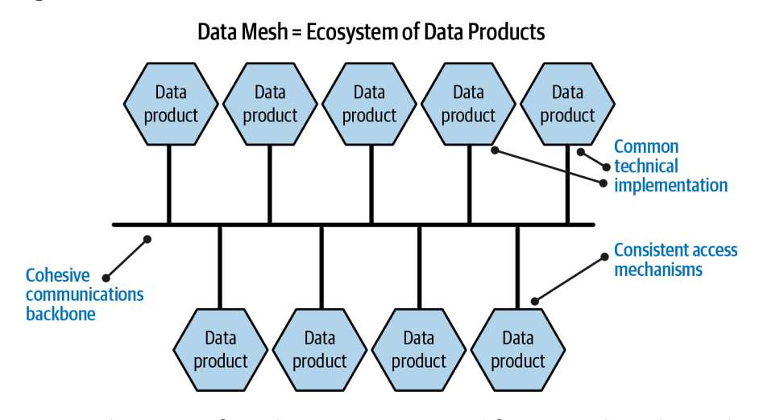
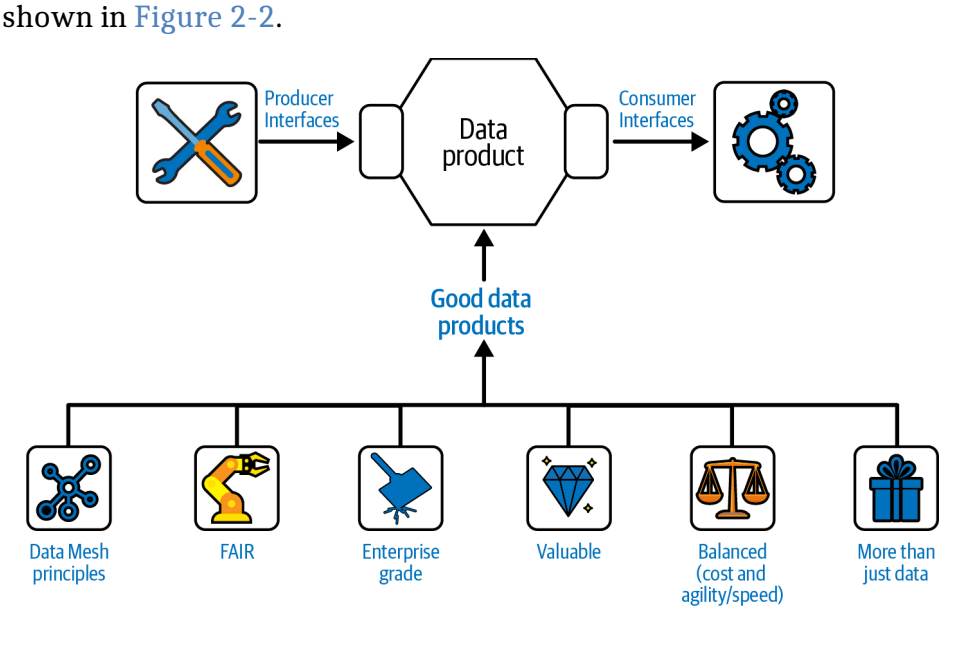
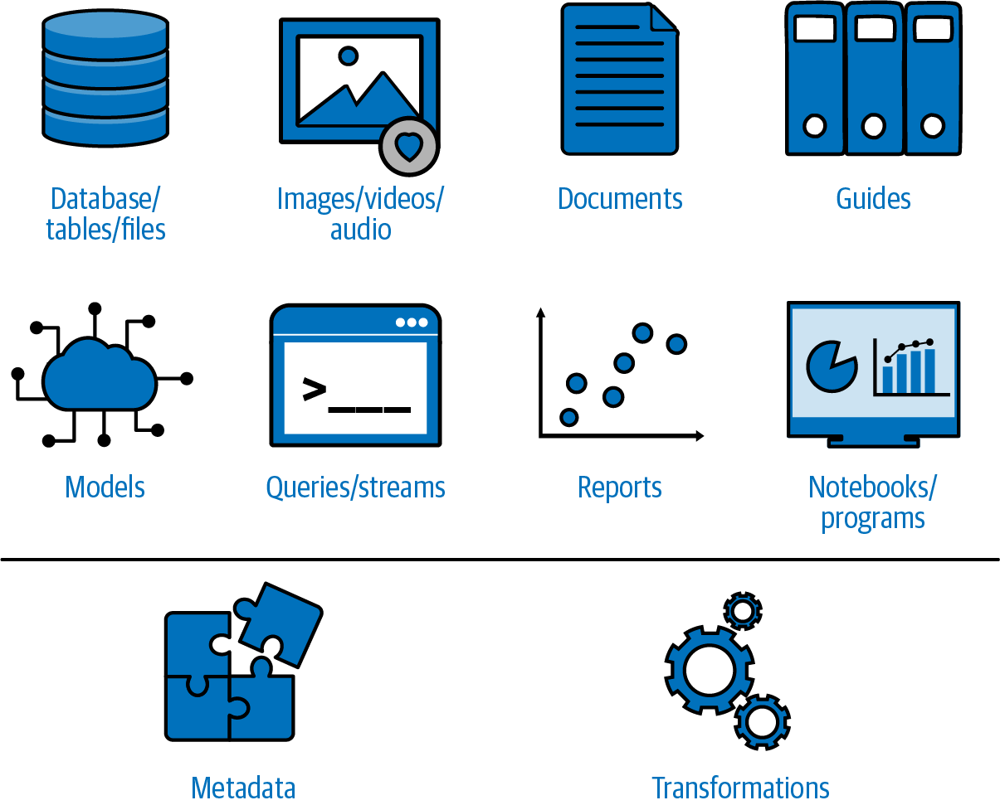
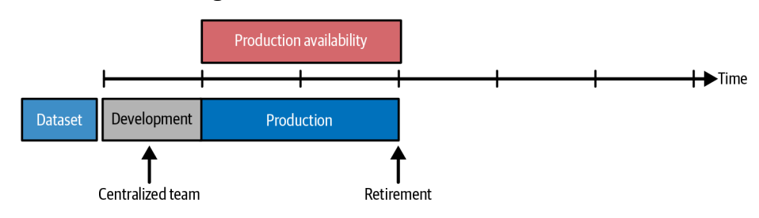
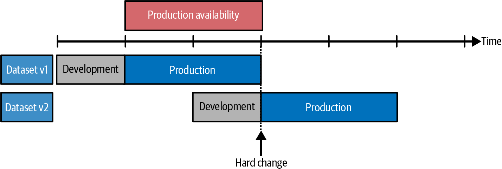
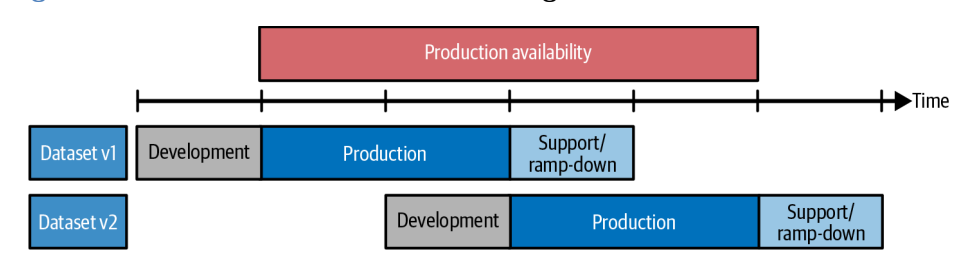
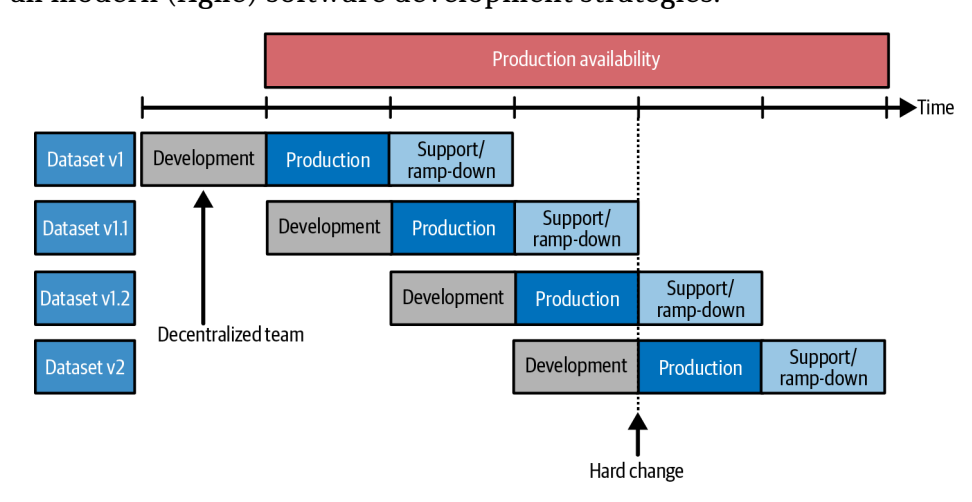
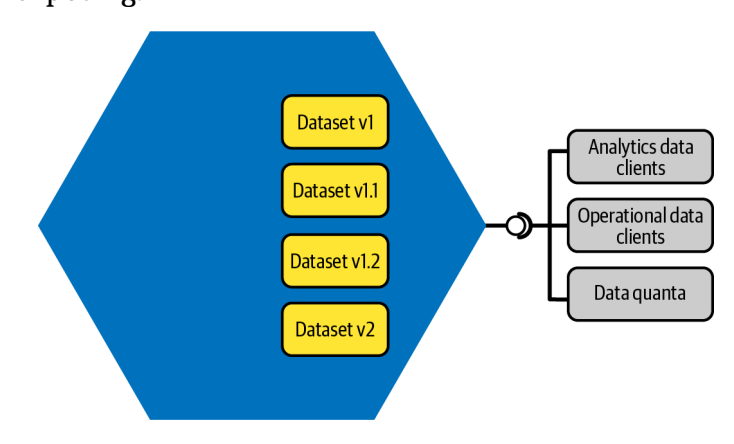
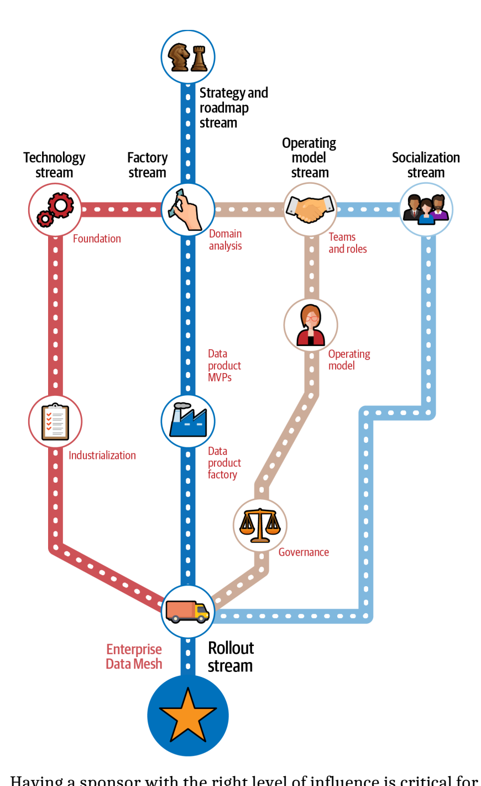

如图 2-1 所示，最简单的 _数据网格_ 就是一个由交互数据产品组成的生态系统。 在任何生态系统中，都有许多活动部件，每个部件都在一定程度上独立运行，但通过通用标准和通信主干网连接在一起。 理想情况下，数据网格中的数据产品具有一套统一接口的通用技术实现。

_图 2-1._ 数据网格：由交互式数据产品组成的生态系统

数据网格的基础是数据架构领域的一个概念框架，它强调分散的数据所有权和架构。 它认识到，在大型组织中，数据量巨大且种类繁多，每个业务领域对自身数据都有很大程度的自主权（以及对本地数据的了解和掌握）。 通过分散控制，Data Mesh 使各个域能够管理其数据并做出决策，同时保持整体结构的一致性。 有了这种自主性，就可以更好、更本地化、更快地做出决策，从而提高速度和灵活性。

在数据网格中，"数据产品 "是一个数据包，它自成一体，具有自描述性，并面向特定的业务目的或功能。 数据产品是为实现组织内特定业务目标而精心设计的数据包。 它们不仅仅是数据的集合，而是将数据本身与基本工具、文档和元数据封装在一起的综合单元。 这确保了数据不仅存在，而且可以理解和使用。 每个数据产品都以目的为导向，为满足特定业务需求或解决特定问题而量身定制，使其不仅仅是信息存储库。

数据产品的结构是自足的，这意味着它包含了有效利用所需的一切。 它坚持严格的质量和管理标准，从而确保可靠性、安全性和符合相关法规。 这种全面的方法使数据产品成为组织内值得信赖和依靠的资源。 它们在设计时考虑到了用户的可访问性，提供的界面和文档便于从数据专家到极少专业技术知识的各类用户浏览。

此外，每个数据产品的生命周期都得到了精心管理。 每个数据产品都有指定的所有者，负责维护、更新和整体管理。 这种管理可确保数据产品保持相关性，并随着时间的推移继续提供价值。 对这些数据产品的持续监督和改进是其不断发展的基础，可确保它们与组织的动态需求和目标保持一致。 这种生命周期管理是数据产品的一个重要方面，它使数据产品不仅仅是静态数据集，而是数据网格生态系统中不断发展的资产。

关于 Data Mesh 生态系统，我们将在第 4 章详细介绍。

## 数据网格原则

正如我们在第 1 章中提到的，Data Mesh 的核心是一套指导原则，其中每项原则都对该框架的有效性和可持续性起着至关重要的作用。 让我们在这里详细介绍一下。

### 数据作为一种产品

这些原则中的第一条就是将数据视为产品。 在传统的产品管理中，产品要满足需求、有所有者（稍后详述）、有长期路线图（与项目不同，项目有开始和结束时间）。 所有这些特点也适用于数据产品。

这些特征为每个数据产品确立了明确的边界。 这种边界划分描述了一个领域，对于定义数据产品所代表的内容、范围和局限性至关重要。 数据网格中清晰的边界可确保每个数据产品都是更大生态系统中定义明确的实体。 这种明确性有助于人们清楚地了解数据产品的目的，并有助于管理期望值以及适当地引导工作和资源，确保每个数据产品都能有效地发挥其预期作用。

但还不止这些。 在 Zhamak Dehghani 的著作[_Data Mesh_](https://learning.oreilly.com/library/view/data-mesh/9781492092384/)中，她将数据产品描述为可发现、可寻址、可理解、可信和真实、本地可访问、可互操作和可组合、自身有价值以及安全。 我们将在后面的章节中进一步讨论这些具体属性。

### 去中心化域名所有权

Data Mesh 框架的另一个基本原则是分散域所有权的概念，它能有效地为每个数据产品建立一个授权所有者（和团队）。 该框架的这一方面借鉴了为每个城市街区配备一名专职管理者的理念，该管理者要对街区的福祉进行深入投资和负责。 同样，数据网格中的每个数据产品都有一个所有者，对其性能、质量和是否符合管理标准负责。

获得授权的 DPO 的作用是多方面的。 DPO 的任务是确保数据产品符合具体业务要求和总体治理框架。 这种协调对于保持数据产品的完整性和实用性至关重要，可确保其始终是组织数据环境中的宝贵资产。

### 自服务数据平台

数据网格概念的第三个核心原则是为消费者和生产者提供自服务能力。

对于数据消费者来说，"自服务 "意味着能够轻松查找、消费和信任数据，而无需第三方（或中央团队或工程小组）的协助。 这通常是作为一个 "市场 "来实现的，它提供一个门户网站（网络/移动网站），将数据产品分组，供消费者使用。

现在，我想简单说一下 "市场 "这个词：与数据目录相比，市场的独特之处在于它既提供消费者功能，也提供生产者功能。 通常所说的 "双面市场 "\*既能让消费者找到数据，也能让数据生产者轻松发布数据。 从这个意义上说，市场的生产者能力也是自助式的。 数据网格应使任何人（在遵守正常安全规定的前提下）都能轻松发布数据产品。

数据网格中的自助服务功能不仅能增强用户的能力，还能培养创新和敏捷的文化。 它使个人能够利用数据满足其特定需求，鼓励实验和个性化分析。 这种功能减少了通常与集中式数据系统相关的瓶颈问题，因为在集中式数据系统中，数据访问和分析请求可能会延缓决策进程。

### 联合计算治理

指导 Data Mesh 框架的最后一项原则是联合计算治理，它指的是一种分散的方法，用于管理和执行组织内不同领域或团队的数据策略、标准和质量。

联合治理将这些职责分配给特定领域的团队，而不是由一个集中的数据治理团队来实施规则和标准。 每个团队在遵守组织层面制定的总体原则的同时，管理自己的数据。 尽管数据所有权是分散的，但联邦计算治理确保有一个统一的框架来管理、使用和共享数据。

目前，可以说 Data Mesh 为改进数据管理提供的机会还处于起步阶段。 因此，实施联合计算治理需要微妙的平衡。 这涉及到创建足够强大的治理结构，以确保一致性和合规性，同时又足够灵活，以适应不同数据产品的独特需求和环境。 这种平衡是营造创新环境的关键所在，在这种环境中，创新可以蓬勃发展，同时又不会损害对具有凝聚力的数据生态系统至关重要的标准和协议。

## 定义 "优质 "数据产品

如前所述，数据网格是一个数据产品生态系统。 实际上，数据产品是任何数据网格的基础构件，也是不可分割的最小单位，类似于 "数据量子"。 显然，数据产品至关重要，但 "好 "数据产品的定义是什么？ 如图 2-2 所示，构成 "好 "数据产品的属性有很多，包括技术、业务、易用性和其他特征。

### 定义有原则的数据产品

那么，从哪里开始呢？ 让我们从一个简单、也许显而易见的声明开始：好的数据产品遵守 Data Mesh 原则。 让我们来看看这些原则，并将它们应用到数据产品中。

首先，好的数据产品应与分散的领域所有权相一致：它们应与一个边界清晰的领域（无论大小）相一致，并有一个获得授权的所有者。 其次，好的数据产品顾名思义是产品而不是项目。 好的数据产品和其他产品一样，都有一个生命周期、明确的消费者和清晰的价值定位。 好的数据产品是自助式的，这意味着用户可以从数据产品中获得他们需要的东西，而无需第三方的过度参与。 好的数据产品有一个联合治理机制，为 DPO 及其团队在数据产品层面提供地方自主权和决策权。 这也意味着 DPO 及其团队有责任确保其数据产品符合企业准则和标准。

### 定义公平的数据产品

好的数据产品还应遵守 [FAIR 原则](https://oreil.ly/4Mp_d)。 数据应该是

- 可查找
- 无障碍
- 互操作性
- 可重复使用

根据 [FAIR](https://oreil.ly/4Mp_d)，"原则强调机器可操作性（即计算系统在没有或极少人类干预的情况下查找、访问、互操作和重复使用数据的能力），因为随着数据量、复杂性和创建速度的增加，人类越来越依赖于计算支持来处理数据"。

让我们详细阐述这些原则，并将其应用到数据产品中。 _可查找性_是 FAIR 原则的第一条。 数据产品要想有价值，就必须能在企业更广泛的数据范围内被轻松发现。

_可访问性_是另一个关键原则（请注意，我们使用 "可访问性\*"是指一般意义上的可访问性--易于使用，而不是指满足用户特定的可访问性需求）。 数据仅仅可查找是不够的：一旦被找到，数据产品还必须易于访问。 可访问性包括提供全面的文档，解释如何使用数据，以及确保数据可以轻松集成到各种应用程序和工作流程中。 好的数据产品应该像设计精良的软件应用程序一样简单易用，并有明确的说明和支持。

_互操作性_是 FAIR 原则的一个重要方面。 这是指数据产品协同工作和有效整合的能力。 实际上，这意味着应使用标准数据格式和协议创建数据产品。 例如，如果一个数据产品使用 XML 格式，而另一个使用 JSON 格式，那么就应该有相应的工具或服务，使这些不同的格式能够无缝地结合在一起使用。 同样，互操作性也可能意味着使用通用标准（如 SQL 或 RESTful API）或通用标识符。 这种互操作性对于组合和利用各种来源的数据至关重要。

第四个原则是_重复使用_，重点是在多种情况下应用数据的能力。 这一原则对于最大化数据价值尤为重要。 设计成模块化和可重复使用的数据产品可用于不同的项目和应用。 例如，包含客户人口信息的数据产品可用于营销团队的营销活动规划、销售团队的销售策略制定以及产品开发团队的市场分析。

除了这些技术方面的问题，遵守 FAIR 原则还涉及到培养一种合作和数据共享的文化。 这种文化转变对于打破孤岛和鼓励重复使用数据产品至关重要。 这意味着要推广一种组织思维，将数据视为可用于多种目的的共享资源。

总之，数据网格中的 "好 "数据产品是指那些 FAIR 数据产品：可查找、可访问、可互操作、可重用。 这些原则确保数据不仅得到存储，还得到积极的管理和使用，从而为组织增值。 遵循 FAIR 原则的数据产品不仅仅是信息存储库，它们还能转化为动态资产，推动整个企业的创新和决策制定。

### 定义企业级数据产品

FAIR 原则为理解 "优质" 数据产品提供了一个视角。 但是，在企业中，怎样的数据产品才算 "好 "产品呢？ 或者更具体地说，"好的 "企业级数据产品的定义是什么？ 在企业级数据产品领域，有几个关键属性共同决定了产品的质量和有效性。 这些属性包括安全性、可靠性、可观测性、可操作性、可部署性和全面的文档，形成了一个有凝聚力的结构，可确保数据产品在组织内的价值。

实际上，企业级数据产品的优势在于其关键属性的无缝集成。 安全性、可靠性、可观察性、可操作性、可部署性和全面的文档不是孤立的，而是相互关联的，每个方面都对产品的整体功能和价值起着至关重要的作用。 满足这些要求的产品不仅仅是一个数据存储库，更是一种能推动业务效率、创新和决策制定的动态资产。 要创建符合企业环境严格要求的数据产品，了解这些属性如何相互作用和相互支持至关重要。

在这些企业级属性中，_安全_ 可能是最重要的。 企业级数据产品必须能够抵御未经授权的访问和违规行为，确保所保存数据的机密性和完整性。 这种安全性不仅关系到信息安全，还关系到维护用户信任和遵守监管标准，如 GDPR 或 HIPAA。 在这一过程中，实施强大的加密、访问控制和定期安全审计是不可或缺的，这将为潜在的网络威胁建立一道坚固的屏障。

然而，仅有安全是不够的。 数据产品的可靠性同样重要。 用户需要相信数据产品在任何时候都能提供准确、一致的信息。 确保可靠性包括实施验证检查和错误检测算法，以及保持数据的高可用性。 这就是可靠性概念与安全性概念的交叉点：安全的数据产品本质上更加可靠，因为它能防止数据被篡改和丢失。

_可观察性_扩展了可靠性的概念。 这关系到能否监控数据产品的健康状况和性能。 通过使用工具跟踪响应时间和错误率等各种指标，企业可以主动管理数据产品的健康状况或数据质量。 这种积极主动的管理对保持产品的可靠性起着至关重要的作用，因为它可以在潜在问题升级之前及早发现和解决。

与可观察性密切相关的是_可操作性_方面。 操作性强的数据产品更易于管理和操作。 这涉及简化数据产品生命周期管理的功能，包括部署、扩展、更新和故障排除。 高可操作性可确保产品在整个生命周期内保持功能性和有效性，以最小的干扰适应不断变化的要求，从而支持产品的可靠性。

_可部署性_是另一个关键属性，尤其是在动态业务环境中。 高度可部署的数据产品可轻松实施并集成到各种业务流程和技术环境中。 无论是扩大规模以适应业务增长，还是与新系统和应用程序集成，这种灵活性对于跟上企业不断变化的需求都至关重要。

所有这些特性的基础是_全面的文档_。 文档是数据产品的支柱，可明确说明数据产品的使用、管理和集成。 它包括从用户指南和 API 文档到操作程序和架构图的所有内容。 良好的文档记录不仅有助于有效利用数据产品，还能确保符合监管标准，便于审计和合规检查。

这些属性之间的相互作用创造了一个整体的企业级数据产品。 例如，健全的文档可通过概述精确的数据处理程序来提高安全性，而可观测性则可通过确定预测性维护需求来为可靠性战略提供信息。 同样，结构合理的文档通常也便于操作，为管理和更新数据产品提供了明确的指导。

### 定义有价值的数据产品

俗话说，"爱美之心人皆有之"。 尽管如此，我们还是可以利用数据产品的一些客观特征来清晰明确地确定其价值。 首先，有价值的数据产品从根本上说是由其相关性和实用性决定的。 此类产品的主要目的是解决具体的业务需求或问题，使其成为知情决策和洞察力生成的重要工具。 其价值与其在解决实际业务问题或提高运营效率方面的实际应用直接相关。 因此，衡量一个数据产品是否有用的标准是，它是否能够促进行动、支持决策或提供直接适用于用户需求的见解。

质量和可靠性是有价值的数据产品不可或缺的属性。 这些属性不仅包括数据的准确性、一致性和完整性，还包括数据的及时性和与当前业务场景的相关性。 此外，可靠性还包括数据产品的技术方面，包括其性能，如处理速度和可用性。 确保高质量和高可靠性至关重要，因为这些因素会直接影响数据产品在操作和决策过程中的可信度和可靠性。

可用性是决定数据产品价值的关键因素：如果数据产品过于复杂或不直观，那么无论基础数据质量如何，其潜在效用都会降低。 因此，数据产品的设计和界面应便于使用，以确保其目标用户能够有效地加以利用。 与此稍有关联的是互操作性，换句话说，数据产品从操作角度来看也是可用的。 一个有价值的数据产品不仅要能独立运行，还要能与其他数据产品无缝集成。 这种互操作性对于全面分析和洞察力的产生至关重要，因为它允许对不同领域的数据进行组合和分析。 此外，遵守监管要求和安全标准也是不容商量的。 确保数据隐私、遵守 GDPR 或 HIPAA 等法规以及维护稳健的安全协议是数据产品完整性和价值的基础。

最后，可扩展性和可维护性是有价值数据产品的关键方面。 它应能处理不断增加的数据量或用户需求，而无需进行重大的重新设计或返工。 除可扩展性外，可维护性--数据产品是否易于更新、修改或修复--对其长期实用性也至关重要。 这包括产品根据用户反馈和不断变化的业务需求进行演变的能力，确保产品长期保持相关性和价值。 与组织的战略目标保持一致并为业务目标做出贡献--无论是通过降低成本、创造收入还是风险管理--都能巩固数据产品在组织生态系统中的价值。

### 定义平衡数据产品

传统上，IT 组织--尤其是那些高度集中的组织--在很大程度上倾向于优化成本控制。 当信息技术与业务成果联系不紧密或仅有间接联系时，成本控制--注重效率--就很常见。 这种关注虽然在财务上是谨慎的，但往往与企业对速度和灵活性日益增长的需求相冲突，而在当今快节奏的市场环境中，速度和灵活性越来越重要。 有价值的数据产品的一个关键属性就是在成本和效率与速度和灵活性之间实现平衡。

然而，转换一下视角就会发现一个有趣的动态。 事实上，经验表明，优先考虑速度和敏捷性并不一定会影响成本效益，通过专注于这些方面，企业可以实现更高效的产品交付，从长远来看可以节约成本。 这种效率源于快速适应市场变化、客户需求和新技术进步的能力，从而减少了耗费在冗长项目周期上的时间和资源。

不过，这确实建议采用渐进式开发方法，将数据产品或其组成能力分解成较小的、可管理的交付单元。 这样就可以根据反馈和不断变化的要求进行快速迭代和调整。 使用原型和最小可行产品（MVP）是这一方法的核心，使团队能够在不投入大量资源进行全面开发的情况下测试想法和概念。 显然，刚开始使用 Data Mesh 的组织应该考虑这种方法。

渐进式方法有几个好处。 首先，由于可以在更短的周期内实施和测试变更，因此可以更快地响应市场需求和客户反馈。 其次，它降低了与大型数据产品相关的风险，因为可以在过程中进行调整，避免了完全致力于单一、僵化的交付计划所带来的代价高昂的隐患。

### 定义现代数据产品--不仅仅是"常规"数据

数据网格中的数据产品通常被认为只围绕"传统"数据：数据库、表格等。 不过，这种观点有一定局限性，甚至可能已经过时。 虽然这类数据确实是基础要素，但数据产品包含的人工制品要广泛得多。

在这种情况下，_人工制品_是指 DPO 决定向数据产品用户或更广泛受众提供的任何对象、实体或项目，如图 2-3 所示。

_图 2-3._ 数据产品人工制品

这些工件是数据产品的 "内部结构"，可能包括

- "常规"数据，如数据库、表格或文件。 我们称之为 "常规 "数据，因为它是当今数据产品中最常见的人工制品类型。 数据产品可能会继续优先集成和管理数据库、表格和文件等传统数据形式，因为这些结构化数据类型是大多数分析和操作流程的基础。

- 图像、视频和音频，在我们的现代多模态数据环境中已变得司空见惯。 这些数据形式提供了丰富的上下文信息，可显著增强分析、ML 模型和决策过程。 随着企业致力于获得更全面的洞察力，无缝处理和分析结构化和非结构化数据（如可视化内容）的能力变得越来越重要。

- 文档，如 PDF 或其他面向文本的非结构化数据。 - 指南，可帮助消费者了解或消费数据产品。 不言而喻，清晰而全面的文档有助于用户了解如何有效地利用每个人工制品。 当然，这些文件应易于获取和理解，以满足不同专业水平的用户的需求。

- 模型，包括较早的人工智能/ML 模型以及较新的生成式人工智能大型语言模型。 在许多现代数据产品中，数据被用于训练或微调 ML 或 AI 模型。 这些模型在作为人工制品并提供给用户使用时，可以为数据产品中的数据提供独特的见解。

- 经过审核（安全、性能良好等）的查询，可简化数据产品的使用。 这些可以包括预编写的 SQL 查询或其他访问方法，为用户提供随时可用的洞察力。 这些查询对那些可能不具备深厚的专业技术知识，但需要从数据产品中获取有意义信息的用户尤为重要。 数据流代表了数据产品的一个动态方面，用户可以订阅数据产品中的特定主题，并在数据发生变化或更新时收到通知。

- 报告，提供一套预先格式化的数据产品输出结果。 - 演示如何有效使用产品中的数据或展示数据产品中使用的处理逻辑的笔记本和程序。 这些计划可能包括为数据产品用户提供 "入门套件"，让他们了解如何与数据互动并从中获取价值。 这些程序可以展示从数据中得出的关键见解或分析，为用户的探索提供一个良好的开端。

- 元数据，或有关数据产品、其内容、字段和格式的数据。 - 转换，包括管道和其他工作流程工具，用于接收数据并将其转换为消费者可用和方便的形式。

选择要纳入数据产品的人工制品是一项重要决定。 它反映了 DPO 对目标受众的需求和偏好的理解。 通过精心整理这些人工制品，所有者可以大大提高数据产品的可用性和吸引力。 这通常需要深入了解人工制品的技术方面和数据产品中的用户旅程。

现在，什么是现代数据产品？ 它是一种数据产品，可以超越"常规"数据，并认识到不断变化的数据环境和我们所处的多模态数据世界。 它是一种数据产品，包含全面的数据和工具，包括人工智能模型、笔记本或程序，使复杂的数据洞察成为可能。 它是一款数据产品，展示了数据管理从静态存储到动态互动平台的演变过程，使用户能够从数据中获得更大的价值和洞察力。

### 定义实用的数据产品生命周期

当你在考虑一个产品时，你就在隐含地考虑它的生命周期。 让我们考虑一下您的汽车（如果您没有汽车，您可能认识一个有汽车的人）。 在你购买之前，制造商需要一定的时间来设计、开发和测试。 在某一机型上市销售的同时，制造商还在继续开发新的机型。 丰田凯美瑞就是一个很好的例子，该车于 1979 年作为 Celica Camry 推出，45 年后的今天仍在销售。 下面我们就以凯美瑞为例进行说明。

在传统的数据工程中，通常由一个集中的团队负责构建数据集。 如 [图 2-4]（file:///opt/Koodo Reader/resources/app.asar/build/index.html#fig_4_data_product_lifecycle_early_stages）所示，该团队会交付数据集；或者支持数据集，或者将数据集移交给运营团队，直到数据集退役。 事实上，大多数数据项目都是这样的：经过一段时间的开发后，项目就会进入生产阶段，直至退出。 由于没有替代数据集，退休往往是不可能的。 回想起我们的凯美瑞，就好像我们还在驾驶一辆 20 世纪 90 年代的汽车。

图 2-4. _数据产品生命周期（早期阶段）_

如果要建立一个新的数据集来取代第一个版本，过渡往往非常困难。 如图 2-5 所示，数据集正在从版本 1 向版本 2 演进，如果没有足够的时间来促进过渡，就会给消耗团队带来巨大的负担。 过渡时期可能会很艰难，会有很多变化。

 没有足够的时间 图 2-5. 数据产品生命周期（数据集的新版本）
为了缓和数据集两个版本之间的过渡，团队可以在其中包含一个支持期或下降期，在此期间同时提供两个数据集，如图 2-6 所示，数据集正在从版本 1 演进到版本 2。

图 2-6. 数据产品生命周期（在数据集版本之间有一个缩减期）

这些设计非常适合拥有中心团队的组织。 交付数据集后，开发团队可能会转向另一个项目。 这样做的缺点是，不能保证负责 v2 项目的团队与负责 v1 项目的团队相同，因此无法充分利用在 v1 项目中获得的专业知识。

想象一下，你可以迭代改进你的产品，提供增量价值，而不是大爆炸式的转变。 回到凯美瑞的例子，2014 款和 2015 款之间有一个渐进的转变，但这并不是一个重大的车型变化（比如 2016 款和 2017 款之间的变化）。 使用语义版本法，凯美瑞 2014 款可能是 v50.14.0，2015 款可能是 v50.15.0；然而，2017 款将是 v70.0.0，这表明发生了重大变化。

如图 2-7 所示，这种方法不排除需要进行重大（和破坏性）改动。 尽管如此，您仍然可以让您的开发团队集中精力，完成任务，并增长他们的领域专业知识。 开发团队不必那么庞大，但更重要的是，您将看到持续的关注、不断增长的领域专业知识以及对单一、一致的消费者体验的持续改进所带来的好处。 这一流程完全符合所有现代（敏捷）软件开发战略。

图 2-7. 数据产品生命周期（数据集的增量和新版本）

如图 2-8 所示，随着数据集的构建和增长，它们会保持与同一领域一致，提供类似的用户体验。 此外，数据合同（将在第 5 章中详细阐述）将为您公开的数据集提供大量信息。

图 2-8 新版本数据集的用户体验

### 确定实用的数据网格路线图

现在，我们已经解释了数据产品的技术方面--它们遵守 Data Mesh 和 FAIR 原则，并具备被视为企业级的属性。 它们应该是有价值的、平衡的，而且应该认识到不断变化的数据环境。 但它们还必须切合实际：不仅需要战略和愿景，还需要路线图和实施计划。 他们需要赞助和资金，否则数据产品根本无法启动。 他们需要一支技术精湛的团队，以适应数据产品的技术和数据足迹，而且他们与组织其他部门的运作和协作方式必须与数据产品团队的运作方式不可分割。

首先，我们要将数据产品的战略和愿景转化为切实可行的路线图。 数据产品的战略和愿景既要雄心勃勃，又要切实可行。 它需要在理想目标和实际现实之间取得平衡。 目标状态应是对现状的挑战，但仍应基于当前的技术能力和组织背景下现实可实现的目标。 实用的数据产品有一个明确的目标状态或最终目标，与其对组织的预期贡献相一致。 这些内容将在后面的章节中详细阐述。

如图 2-9 所示，与目标状态明显相关的是需要一个路线图：一种到达目标状态的方法。

路线图是一项计划，详细说明了数据产品从当前状态到未来理想状态的发展过程，涉及技术（"技术流"）、流程（"工厂流"）、资源和运营模式（"运营模式流"）、沟通计划（"社会化流"），当然还包括相关的时间表。 这显然是一个大课题，第 16 章将提供更多细节。

现在，让我们来解决赞助和资金问题。 认识到数据产品长期性的高级管理人员的积极参与至关重要，而这正是我们赞助商的作用所在。 发起人通常是组织内的高层管理人员或决策者，负责支持数据产品。 他们的支持对于使数据产品与组织更广泛的目标和战略保持一致至关重要。 赞助商的作用不仅仅是认可。 他们在克服组织障碍和在各部门宣传数据产品方面发挥着重要作用。 他们的影响力对于确保组织内不同利益相关者的认同、确保数据产品得到有效整合和利用至关重要。

图 2-9.

拥有一个具有适当影响力的发起人，对于确保数据产品不会在其他组织优先事项中被搁置或丢失至关重要。 赞助商的作用不仅包括确保资金，还包括确保在整个开发和部署过程中为数据产品提供持续支持。 据推测，有了赞助商，就有了一个可持续的资助机制，也就有了创建和运行可行、实用的数据产品所需的激励机制。 我们在关于运营模式的章节（第 15 章）中也提到了这一点。

### 一个 "好"的数据产品要有一个有能力的数据产品负责人

获得授权的 DPO 对于数据产品的成功和有效性至关重要。 从这个意义上说，这不是有价值数据产品的具体属性，但它仍然是提供有价值数据产品的必要条件。 事实上，是由 DPO 来决定什么是有价值的。 它们决定了成本/效率与速度/灵活性之间的平衡。 他们在当地的自主权是影响和指导数据产品从产生到生产的决策权的基础。 显而易见：没有获得授权的 DPO，就不可能有可行的数据产品。

第 14 章中对此有详尽的介绍，这里值得深入探讨一下。 DPO 肩负重大责任和权力，负责监督数据产品的开发、整体健康状况、性能以及数据产品与业务需求的战略一致性。 DPO 的职责是多方面的，包括数据产品管理的各个方面，从概念化到实施和持续维护。

问责制是 DPO 作用的一个重要方面。 他们对数据产品产生的结果负责。 这意味着要确保产品符合所有质量和合规标准，并达到预期效果。 他们的责任延伸到所有利益相关者，包括技术团队、业务用户和高级管理层，要求他们对产品的进度和性能保持透明和公开的沟通。

赋予 DPO 的关键权力之一是决定权。 他们有权就数据产品的开发、部署和演变做出关键决策。 这包括有关特性、功能和产品总体方向的决策。 他们的决策权对于在瞬息万变的商业环境中保持产品的实用性和有效性至关重要。

有了这些决定权，获得授权的 DPO 就有了高度的自主权。 这种自主性使他们能够在数据产品的既定范围内独立运作，做出决策并实施促进创新和灵活性的战略。 赋予他们的自主权并非不受约束，而是要与更广泛的组织目标和战略保持一致。

让我们把这个问题具体化一点。 需要明确决策权的一个常见情况涉及为数据产品选择技术工具和平台。 企业经常会有一套首选的工具和平台，并在整个运营过程中强制使用。 不过，数据保护员（或数据产品工程师）可能会找出他们认为对特定数据产品更有效的替代工具。

在这种情况下，如果遵守数据网格原则，则由数据保护官做出决定。 他们有权选择最适合其数据产品需求的工具和技术。 这种自主性对于确保使用最合适、最有效的技术构建数据产品至关重要。

然而，这种决策自主权并不意味着与企业其他部门的隔离。 企业则应把重点放在使其推荐的工具有效、高效和方便用户使用上。 目标应该是创造一种环境，让 DPO 看到使用企业推荐工具的价值，而不是因为这些工具是强制性的，而是因为它们真正满足了他们的需求。

## 确定数据产品

您需要回答的第一个重要问题可能是："如何开始构建数据产品？ 我们想给你一个非常简单的答案。 但是，尽管我们已经开发了许多数据产品，我们仍然没有保证设计成功的秘诀。 我们能做的就是分享一些基本准则（第 16 章也补充了一些信息）。

与客户交流是关键。 您可能已经在这样做了，但您需要确保询问他们的优先事项，因为他们可能并不熟悉这些优先事项。 您应该确定他们在某个日期之前需要哪些数据，以及是否可以分批交付：v1.0、v1.1、v1.2 等。 考虑让多个客户参与进来，扩大使用范围。

想想领域驱动设计（DDD）。 这是一种流行的软件设计方法，其重点是根据某一领域专家的意见，建立与该领域相匹配的软件模型。 在DD 模式下，软件代码的结构、语言（类名、类方法、类变量）和数据工件应与业务领域相匹配。 如果您有兴趣了解更多有关领域驱动设计的信息，请参阅 Vlad Khononov（O'Reilly）撰写的 [_Learning Domain-Driven Design_](https://www.oreilly.com/library/view/learning-domain-driven-design/9781098100124/) 一书。

您需要确定将成为 DPO 的人员（您将在第 14 章中进一步了解 DPO 的职责）。 在这一阶段，他们的职责包括以下任务：

- 定义数据产品的功能并确定其优先次序

  DPO 根据业务目标和用户需求调整功能；采用敏捷方法进行增量开发，从 MVP 开始；根据持续的用户反馈和性能指标保持持续调整的灵活性，以确保产品有效发展，为利益相关者提供最大价值。

- 创建和管理产品路线图

  业务运营总监定义清晰的愿景和战略目标，然后将其转化为时间表，并根据其价值、技术可行性以及与业务目标的一致性，对功能和里程碑进行优先排序。

- 确定优先次序并管理产品积压工作

  DPO 根据项目的价值、可行性和与战略目标的一致性，不断对项目进行完善和排序。

- 验证并接受产品增量

  DPO 根据预定义的验收标准严格测试和审查每个已完成的功能或增强功能，以确保其符合质量标准和用户要求。

不要煮沸海洋。 以快速实现价值为目标，随时准备迭代。 正如您在数据产品生命周期中所看到的，数据产品的设计就是为了不断演进。 您可以修改第一个数据产品。

## 总结

至此，我们明白了什么是"好"的数据产品：它遵循 Data Mesh 原则，并与 FAIR 原则保持一致。它是企业级的。它能带来真正的、实实在在的价值。它兼顾了成本、灵活性和速度。它不仅仅是数据。而且，数据产品的所有者和生命周期都已获得授权，可以确定并兑现数据产品的承诺。

下一个显而易见的问题是："如何构建一个具备所有这些属性的'好'数据产品？ 接下来的两章将启动这一进程。 首先，我们将介绍一个贯穿全书的场景，展示如何将这些原则和特性付诸实践，然后我们将深入探讨数据网格及其组成数据产品的架构组件。
